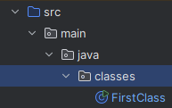

# Java fundamentals - Hello World, classes

In this section:

-   Run our first class
-   Create our first class
-   Learn about classes

## Hello World

To follow along you will need to clone this repo which contains some starter code and a completed repo:
https://github.com/Raphael40/Java-Course-Support-Repo

Once cloned, open the Java-Course-Support-Repo in IntelliJ.

At this point you will see a `.idea` directory has been made. IntelliJ creates this directory to store settings, version controls, and metadata about your project. You can ignore it.

Next we want to switch onto the java-fundamentals branch as shown in the image below.


Alternatively you can open a terminal in Intellij by going to the Menu then _View >> Tool Windows >> Terminal_ and running this command: `git switch java-fundamentals`.

Some new files will appear. One of them is the blue `src` folder where we store our Java code. IntelliJ will not run any files that are outside whatever folder is marked blue folder.

Go to the `src/main/java` directory and open the `HelloWorld` file inside. You may be prompted to setup your JDK, when you have, a green arrow will be visible on the toolbar at the top of the interface and in the gutter to the left hand side of the code.

Select one of the green arrows to run your program, the text `Hello, World!` will be printed to the screen.

Congratulations, you have run your first Java program.

```
>> Hello World!
```

In this course I will use **>>** to represent output.

You may notice that an orange `/out` directory has been created, this is where IntelliJ has stored our compiled code. We don't want to push `out/` to GitHub so make sure it's in the .gitignore.

### Run with the terminal

It is also useful to know how to run Java code from the terminal. In your terminal navigate to `/src/`. You will have to type two commands, one to compile the file and another to run it.

The first command is `javac` which compiles the java into bytecode.

```
cd /src
javac /main/java/HelloWorld.java
```

After running this command a new file will appear called `HelloWorld.class`. This is a Java bytecode file that the JVM can interpret and run.

Next we run the `java` command:

```
java /main/java/HelloWorld

>> 'Hello, World!'
```

The JVM has read our compiled code and printed the output to the terminal.

## Classes

If we look at the code inside the `HelloWorld.java` file, it can be broken down into three parts.

First we have the text `package main.java` at the top of the page which specifies that the `HelloWorld` class is inside the exercises package. It helps the compiler understand which class is in which package. (A package is a directory for grouping classes).

Following this we have two code blocks, one nested in the other. The outer block looks like this:

```
public class HelloWorld {

}
```

The `public` keyword is an `access modifier`. A security measure that controls the visibility of the class. This is a top level class so it has to be `public` which makes it visible to other classes in the same package and classes in other packages.

`class HelloWorld` declares that this is a class and it is called HelloWorld. A class is a blueprint for creating Java objects which are instances of a class. All Java code is nested within one of these classes. Java's use of classes is the reason it is known as an **Object Oriented Language**.

Inside the class declaration we have another code block:

```
public static void main(String[] args) {

}
```

This is a required publicly accessible **method** called `main`. It is the first thing that is called by the JVM and is used to execute or call other methods in the program. If you have a program with multiple classes then only one of them needs to have a main() method but the others can for specific use cases.

Within the main() parenthesis is `String[] args` which signifies that the main method takes an optional `Array of Strings` called `args` which is a data structure that we will visit later . We will also visit `static` and `void` later.

Inside the main() method we have the following code `System.out.println("Hello, World!");`. Here we are telling the `System` to print a given line (`println`) to the standard `out`put. Technically `System` is a built in Java class while `out` and `println` are built in Java methods. This results in "Hello, World!" being printed to our terminal.

### Making a new class

Now we're going to make our own class. First lets create a `package` to store it in. A package is like a folder or directory for grouping Java classes together. Right click on the `/main/java` directory then select _New >> package_ and name your new package `classes`.

Then right click on the newly created package and select _New >> Java Class_. Name your class `FirstClass`. Classes always start with a capitalised first letter.



If you open your new file you should see this:

```
package main.java;

public class FirstClass {
}
```

Also, iff you wanted to create a class with the Terminal you would do this:

```
cd src/main/java
mkdir classes
touch classes/FirstClass.java
```

And fill the the code above manually.

**Next**, add a `main` method to your `FirstClass`.

Your code should now look like this:

<details>
<summary>FirstCLass</summary>

```
public class FirstClass {
    public static void main(String[] args) {

    }
}
```

</details>

Next we can add a line that prints the text "This is my first class!" to our output:

<details>
<summary>FirstCLass</summary>

```
public class FirstClass {
    public static void main(String[] items) {
        System.out.println("This is my first class!")
    }
}
```

</details>

Once again we can run this code by selecting the green arrow or compiling it in the terminal using `javac`.

```
>> This is my first class!
```

## References

https://www.digitalocean.com/community/tutorialspublic-static-void-main-string-args-java-main-method

---

In the next section we're going to look at Variables, Operators.

---

[back](../README.md) <span style="float: right;">[next](02_variables_operators.md)</span>
