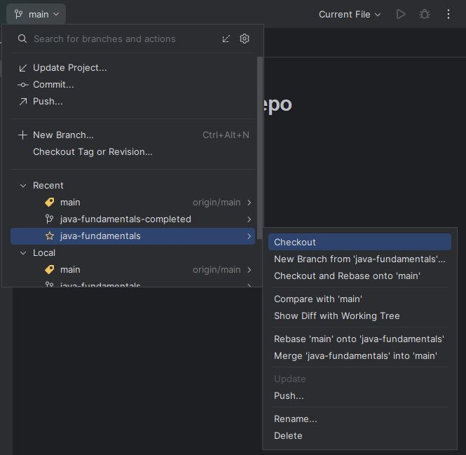
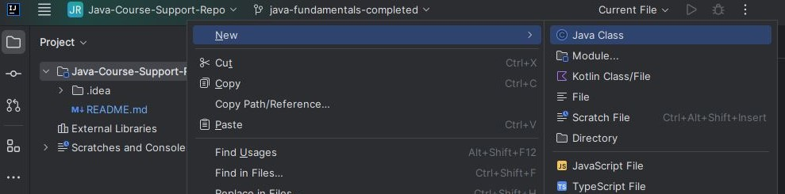

# Java fundamentals - Hello World, classes

In this module we're going to run our first program and look at the fundementals of Java including classes and conditionals.

It is a **strongly typed** language that is mostly used for **object oriented programming**.

## Hello World

To follow along you will need to clone this repo which contains starter code and a completed repo:
https://github.com/Raphael40/Java-Course-Support-Repo

Once cloned you can open the Java-Course-Support-Repo directory in InteliJ.

At this point you will see a .idea directory has been made. IntelliJ creates this directory to store settings, version controls, and metadata about your project. For now you can ignore it.

Next we want to switch onto the java-fundamentals branch as shown in the image below.



Alternatively you can open a terminal in Intellij by going to the Menu then View >> Tool Windows >> Terminal and running this command: `git switch java-fundamentals`

Some new files will appear. Go to the exercises directory and open the `HelloWorld` file inside. If you have installed the JDK correctly a green arrow will be visible on the toolbar at the top of the interface and in the gutter to the left hand side of the code. Select one of the green arrows, the text `Hello, World!` should be printed to the screen.

Congratulations, you have run your first Java program.

### Run with the terminal

If like me you are used to running code with the terminal, from the menu go to View >> Tool Windows >> Terminal to open a new terminal. You will have to type two commands, one to compile the file and another to run it. In the previous step we were able to run the code without manually compiling because IntelliJ does the compilation for us.

```
cd exercises
javac HelloWorld.java
```

After running this command a new file will appear with a `1010` icon called `HelloWorld.class`. This is a Java bytecode file and it is a file that has been converted into a bytecode format that the JVM can read using the Java compiler `javac` command.

Next:

```
java HelloWorld

>> 'Hello, World!'
```

The JVM has read our compiled code and printed the output to the terminal.

## Classes

If we look at the code inside the `HelloWorld.java` file, it can be broken down into three sections.

First we have the text `package exercises` at the top of the page. This simply specifies that the HelloWorld class is inside the exercises package. This is added automatically when the file is created and helps the compiler understand which class is in which package. (A package is a directory for grouping classes).

Following this we have two code blocks, one nested in the other. The outer block looks like this:

```
public class HelloWorld {

}
```

The `public` keyword is an access modifier. Thats a security measure that controls the visibility of the class. As this is a top level class it has to be public which makes it visible to other classes in the same package and classes in other packages. We will look at protected and private classes later in the course.

`class HelloWorld` simply declares that this is a class and it is called HelloWorld. A class is a blueprint for creating Java objects which are instances of a class. If this doesn't make sense at the moment that is ok as it will make more sense when we start coding, however, a key takeaway is that all the Java code is nested within one of these classes.

Inside the class declaration we have another code block:

```
public static void main(String[] args) {

}
```

This is a public method called `main`. Every program has a main method and it is the starting point for the Java application inside the class. We will revisit `static` and `void` later. Within the main() parenthesis is `String[] args` which is also required for this method to run. `String[]` means that this method takes in an array of strings and `args` is the name of that array (args is a placeholder and can be named anything). This array of strings is passed into the method from the terminal.

The `main` method is essential and must exist in every program. It is the first thing that is called by the JVM and is used to execute or call other methods in the program. If you have a program with multiple classes then only one of them needs to have a main method but the others can for specific use cases.

Notice how if we delete the main method from the class the green arrow disappears.

If you want to learn more about the `main` method this Digital Ocean [article](https://www.digitalocean.com/community/tutorials/public-static-void-main-string-args-java-main-method) explains things in more detail.

Within this method we had the following code `System.out.println("Hello, World!");`. To break it down in simple terms we are telling the System to print a given line (println) to the standard output. If we want to be technical, `System` is actually a built in Java class while `out` and `println` are built in methods. This results in "Hello, World!" being printed to our console as we observed earlier.

### Making a new class

Now we're going to make our own class. Right click on the exercises directory then select new >> Java Class



It will promt you to name your class, we're going to call ours `FirstClass`. As you can tell, class naming convention uses a capitalised first letter.

You should have this:

```
package exercises;

public class FirstClass {
}
```

Next, using the HelloWorld class as reference, add a `main` method to your `FirstClass` but name your Strings array `items`

Your code should now look like this:

<details>
<summary>FirstCLass</summary>

```
public class FirstClass {
    public static void main(String[] items) {

    }
}
```

</details>

Next we can add a line that prints text to our output:

<details>
<summary>FirstCLass</summary>

```
public class FirstClass {
    public static void main(String[] items) {
        System.out.println("This is my first class")
    }
}
```

</details>

Once again we can run this code by selecting the green arrow or compiling it in the terminal.

To make a new class with the terminal follow these steps:

<details>
<summary>Terminal</summary>

```
cd exercises
touch MyClass.java
```

Then add the class declaration:

```
package exercises;

public class MyClass {

}

```

Finally add your main method

</details>

### Using String[] args

As mentioned earlier we can pass values into our class using String[] args. We will cover the syntax later but for now, in your `FirstClass` change the print to this:

```
System.out.println(items[0])
```

With IntelliJ

---

In the next section we're going to look at Variables, operators and conditionals.

[next](../java-fundamentals/02_variables_operators_conditionals.md)

---

## [back](../README.md)
