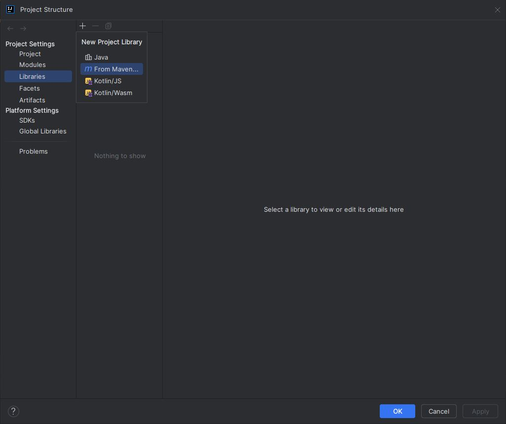
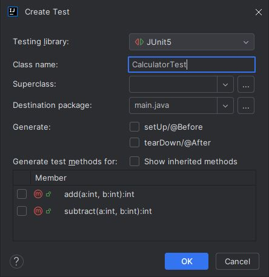
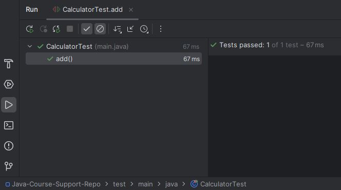

# Testing intro with JUnit

In this section we're going to look at unit testing with JUnit, a testing framework for Java.

## What is a test?

A test is a program designed to verify that another program behaves as expected. There are three types of tests, unit, integration and end to end. A unit test is designed to verify smaller units of code such as methods. We will visit the other two later. If the code works as expected the test should pass, otherwise the test should fail. This is helpful for identifying bugs in your code.

Now we are going to manually write a simple test for this calculator program:

```
public class Calculator {
    public int add(int a, int b) {
        return a + b;
    }

    public int subtract(int a, int b) {
        return a - b;
    }
}

```

First we make a new MyCalculatorTest class:

```
public class MyCalculatorTest {

    public static void main(String[] args) {

    }
}
```

Then we make a new instance of Calculator within our MyCalculatorTest

```
public class MyCalculatorTest {

    public static void main(String[] args) {
        Calculator calculator = new Calculator(); // add this line

    }
}
```

Now we're going to test the add method by calling it from our MyCalculatorTest class. We can use an if statement to check whether the `add()` method returns the expected value:

```
public class MyCalculatorTest {

    public static void main(String[] args) {
        Calculator calculator = new Calculator();

        // Test add method
        if (calculator.add(2, 3) != 5) {
            System.out.println("Test failed: add(2, 3) should be 5");
        } else {
            System.out.println("Test passed: add(2, 3)");
        }
    }
}
```

In this case we are checking if `add(2, 3)` returns `5`. If it is not true that it equals 5 we print `Test failed: add(2, 3) should be 5` else we print `Test passed: add(2, 3)` if it is equal to 5.

Lets do it again for subtract:

```
public class MyCalculatorTest {

    public static void main(String[] args) {
        Calculator calculator = new Calculator();

        // Test add method
        if (calculator.add(2, 3) != 5) {
            System.out.println("Test failed: add(2, 3) should be 5");
        } else {
            System.out.println("Test passed: add(2, 3)");
        }

        // Test subtract method
        if (calculator.subtract(5, 3) != 2) {
            System.out.println("Test failed: subtract(5, 3) should be 2");
        } else {
            System.out.println("Test passed: subtract(5, 3)");
        }
    }
}

>> Test passed: add(2, 3)
>> Test passed: subtract(5, 3)
```

We have manually made two unit tests. If we run the MyCalculatorTest we get two lines printed to the console confirming that the tests have passed.

Now if we break the code in the Calculator class:

```
public class Calculator {
    public int add(int a, int b) {
        return a * b; // Change this line from + to *
    }

    public int subtract(int a, int b) {
        return a - b;
    }
}

```

If we run the MyCalculatorTest now we get:

```
>> Test failed: add(2, 3) should be 5
>> Test passed: subtract(5, 3)
```

## JUnit

### Why use a framework

If we can manually write tests like above then why would we need a testing framework? There are many reasons including:

1. Extended syntax to account for more complex code
2. Capability to run multiple tests in one command
3. Detailed test reports and logs to provide insights
4. Test coverage info (how much of your code is covered by tests)
5. Testing frameworks often integrate with various development tools like web development frameworks

### Install JUnit

Now we are going to test the same `Calculator` class but with JUnit. Since we are using the IntelliJ builder we have to add the JUnit library manually. Go to the menu and select `File > Project Structure` to open a project structure window. Next select `Libraries` in the project settings list and click on `+ > From Maven...`.



A second panel will appear allowing us to download a library from the Maven Repository. In te searchbar we want to enter: `org.junit.jupiter:junit-jupiter:5.9.1`.


Then press `ok` and `apply` in the bottom right of the project structure window to apply our changes. We have now added the JUnit:5.9.1 library to our project. On the left hand toolbar you will be able to see the junit.jupiter directory in the External Libraries dropdown.

Later we will learn about a build tool called `Maven` that will streamline this process.

### First Test

First we need to create a tests root directory which is the location that our JUnit tests will automtaically be created in.

At the top level create a new directory called `test`. Right click on the test directory and at the bottom of the list select `Mark Directory as > Tests Root` and the directory icon should turn green.

If the Tests Root option is not available in the tab you can got to `File > Project Structure > Modules` panel and set the tests directory to the `Tests Root` from there.

Your file structure should look like this:

- src
  - main
    - java
      - Calculator
      - MyCalculatorTest
- test

To create our first test we can first go back to our `Calculator` class and put the curser on the word `Calculator` used as the class declaration.

Either press `Alt+Enter` to bring up the `Actions` tab or right click and select `Show context Actions`.

From the `Actions` tab, select `Create Test` to bring up a test config panel. Here we can name our test class, I will leave mine as `CalculatorTest` and leave the Destination package as `main.java`, which mimics our src file structure. Press `OK`.



Now if we go to our `test` directory we can see that a new `CalculatorTest` class has been added.

Our file structure now looks like this:

- src
  - main
    - java
      - Calculator
      - MyCalculatorTest
- test
  - main
    - java
      - CalculatorTest

Inside our `CalculatorTest.java` file we can see this code:

```
package main.java;

import static org.junit.jupiter.api.Assertions.*;

class CalculatorTest {

}
```

Due to the naming convention `ClassTest` and file structure `test > main > java > ` the test is automatically able to fine the Calculator class it is testing which is why we don't need an import statement.

Type `@Test` inside the CalculatorTest class. This is a JUnit keyword that specifies that the method below it is a test method. After typing it you will be prompted by IntelliJ to add an import statement, add it.

```
import org.junit.jupiter.api.Test; // This line should be added

import static org.junit.jupiter.api.Assertions.*;

class CalculatorTest {

    @Test
}
```

It will still flag an error because we have not written a test.

A test method looks like any other method. Add a method called add:

```
void add() {

}
```

If we try to run this now we will get an error because we have not made any assertions.

Notice at the top of our file we have this line:

```
import static org.junit.jupiter.api.Assertions.*;
```

This will allow us to use all (`*`) methods in the Assertions classs of JUnit.

Inside our method we will now assert that Calculator.add(5, 5) should be equal to 10:

```
assertEquals(5, Calculator.add(2, 3))
```

Run the class and see what happens:



Now try breaking your code in the Calculator class again to see what happens:

```
// Calculator.java

public class Calculator {
    public int add(int a, int b) {
        return a * b; // Change this line from + to *
    }

    public int subtract(int a, int b) {
        return a - b;
    }
}
```

```
org.opentest4j.AssertionFailedError:
Expected :5
Actual   :6
```

This error message tells us that the assertion failed because in this line: `assertEquals(5, Calculator.add(2, 3))` we expected 10 and recieved 6 from `Calculator.add(2, 3)`.

This type of error is much more useful than our hardcoded error message `Test failed: add(2, 3) should be 5`.

We can also add a custom DisplayName to our test:

```
import org.junit.jupiter.api.DisplayName; // Add this line
import org.junit.jupiter.api.Test;

import static org.junit.jupiter.api.Assertions.\*;

class CalculatorTest {

    @Test
    @DisplayName("Add method test - Calculator class") // Add this line
    void add() {
        assertEquals(5, Calculator.add(2, 3));
    }

}
```

Now our name will appear on the left sidebar after we run the test.

We can also disable a test by adding `@Disabled` above it. This can be useful when you have lots of failed tests and want to focus on one at the time without commenting them out (which can let you forget about them).

```
import org.junit.jupiter.api.Disabled;
import org.junit.jupiter.api.DisplayName;
import org.junit.jupiter.api.Test;

import static org.junit.jupiter.api.Assertions.\*;

class CalculatorTest {

    @Disabled
    @Test
    @DisplayName("Add method test - Calculator class")
    void add() {
        assertEquals(5, Calculator.add(2, 3));
    }

}
```

At this point we are noticing the pattern that everytime we use a keyword from the JUnit library we have to import it from `org.junit.jupiter.api`. To improve our understanding of whats happening we can go and look at this directory.

On the left sidebar go to `External Libraries > junit.jupiter > junit-jupiter-api-5.9.1.jar > org.junit.jupiter.api`. In this directory is a list of Java classes installed into our repository when we added the JUnit library. All of which are available for us to use.

Lets add the subtract method:

```
@Test
@DisplayName("Subtract method test - Calculator class")
void subtract() {
    // Assertion here
}
```

And the assertion:

```
assertEquals(2, Calculator.subtract(5, 3));
```

Now we have two passing tests.

We can also use the `assertAll` assertion to run multiple `assertEquals` blocks in a single test:

```
assertAll(() -> assertEquals(2, Calculator.subtract(5, 3)))
```

And then separate additional assertions with a comma:

```
void subtract() {
    assertAll(
        () -> assertEquals(2, Calculator.subtract(5, 3)),
        () -> assertEquals(10, Calculator.subtract(20, 10)),
        () -> assertEquals(-50, Calculator.subtract(100, 150)),
        () -> assertEquals(20, Calculator.subtract(-20, -40))
    );
}
```

Don't worry if this syntax looks unusual to you `() -> expression`. This is a lambda expression which is a way of passing a method as a parameter for another method.

In this case `assertEquals` is automatically called when the `assertAll` method is called.

We will revisit these later.
