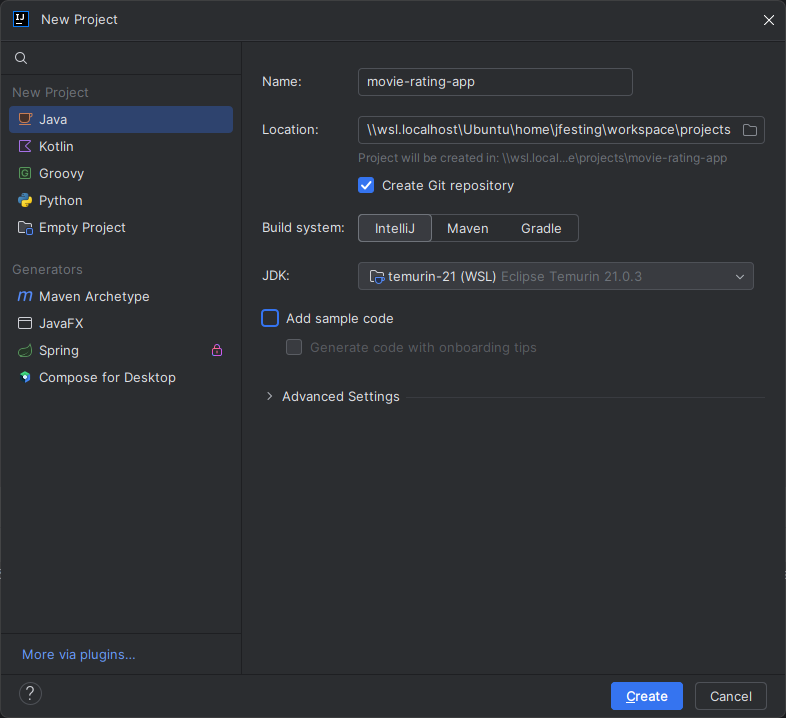
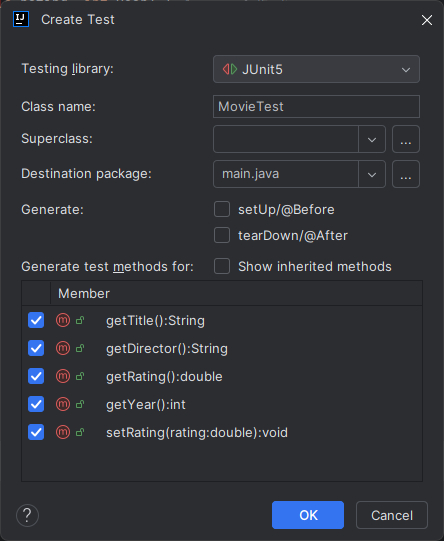

# Movie Rating Command Line App

In this section we are going to build an app that will put everything we have learned so far to practice. A completed repo is available, however there is no starter repo since we will be starting from scratch.

First we are going to quickly look at one more class from the `java.util` package called `Scanner`

## Scanner

The idea of the `Scanner` class is to get user input from the command line as long as it is a primitive value (or String).

By importing Scanner at the top of our file:

```
import java.util.Scanner;
```

We are able to use methods of the Scanner class such as `nextBoolean()`, `nextLine()`, and `nextInt()`.

To use it we have to create a new `Scanner` object and then use the scanner methods to save user input to a variable:

```
class Main {
  public static void main(String[] args) {
    Scanner myScanner = new Scanner(System.in);  // Create a Scanner object

    System.out.println("Enter name here:");
    String name = myObj.nextLine();  // nextLine() takes a user input of String
    // At this point I will be prompted to type a value into the CLI. I enter "Jonny"

    System.out.println("Username is: " + name);  // Now we can use the value
  }
}

>> Username is: Jonny
```

**Note** how we declare a new Scanner object with `System.in` to receive a value from the command line. This is just like how we use System.out to print lines (println) to the console.

We are going to use Scanner to enter movies into our movie rating app.

## Movie Rating App

### Create a new project

From the menu select File >> New >> Project and a New Project panel will appear. **Name** your project `movie-rating-app` and save it to a location of your choice. Leave Create Git repository selected and select IntelliJ as your Build system. **Unselect** Add sample code and leave Generate code with onboarding tips unselected.



This should create a new module containing a .idea directory, a .gitignore file, a project-name.iml file and an src directory.

Inside the src directory we are going to create a `main` package and inside that we are going to create a `java` package. Your path should be movie-rating-app/src/main/java.

Next we want to setup our testing suite. Just like we did in the previous section. Install the `JUnit Jupiter` library into your project using this prompt `org.junit.jupiter:junit-jupiter:5.9.1`, thenj add a test directory and make it the testing root. Then add your main.java packages.

It should look like this:

```
-   src
    -   main
        -   java
            -   Calculator
            -   MyCalculatorTest
-   test
    -   main
        -   java
```

### Movie Class

To make this app we are going to create three classes; `Movie`, `MovieLibrary`, and `Main` which will have our `main` method and act as our user interface. Our `Movie` class represents a single movie. Each instance of `Movie` requires a title for identification and a rating. We can also add a Director and release year to be more informative. The Movie class will have methods to return each value and a method to set a new rating.

Right click on `main.java` package and select New > Java Class:

```
package main.java;

public class Movie {

}
```

Next add the instance fields (title(String), director(String), rating(Double), year(int)) and `Movie` constructor method:

<details>
<summary>constructor</summary>

```
package main.java;

public class Movie {
  private String title;
  private String director;
  private double rating;
  private int year;

  public Movie(String title, String director, double rating, int year) {
      this.title = title;
      this.director = director;
      this.rating = rating;
      this.year = year;
  }
}
```

</details>

<br>

Now we can add our methods. Create 4 methods; `getTitle()`, `getDirector()`, `getRating()` and `getYear()`. Each one just needs to return its corresponding value.

<details>
<summary>getMethods()</summary>

```
public String getTitle() {
    return title;
}

public String getDirector() {
    return director;
}

public double getRating() {
    return rating;
}

public int getYear() {
    return year;
}
```

</details>

<br>

And lastly we can add our setRatings() method. It takes a rating and reassigns the instance rating to the value:

<details>
<summary>setRating()</summary>

```
public void setRating(double rating) {
    this.rating = rating;
}
```

</details>

<br>

The `this` keyword ensures it will only update the value of the instance that the method is called on.

We ought to add in some error handling here to ensure that users can only submit a rating greater than 0 and less than 10.

We can use the `throw` keyword to give the user a custom error like this:

`throw new Exception("Desciption");`

Use an if statement to enforce an `IllegalArgumentException` in the setRating() method:

<details>
<summary>setRating()</summary>

```
public void setRating(double rating) {
    if (rating < 0 || rating > 10) {
        throw new IllegalArgumentException("Rating must be between 0 and 10");
    }
    this.rating = rating;
}
```

</details>

<br>

You can view a list of built in Exceptions [here](https://www.tutorialspoint.com/java/java_builtin_exceptions.htm) and there are also some you can import.

Thats all we need for the movie class. Your code should look like this:

<details>
<summary>Movie Class</summary>

```
package main.java;

public class Movie {
private String title;
private String director;
private double rating;
private int year;

    public Movie(String title, String director, double rating, int year) {
        this.title = title;
        this.director = director;
        this.rating = rating;
        this.year = year;
    }

    public String getTitle() {
        return title;
    }

    public String getDirector() {
        return director;
    }

    public double getRating() {
        return rating;
    }

    public int getYear() {
        return year;
    }

    public void setRating(double rating) {
        if (rating < 0 || rating > 10) {
            throw new IllegalArgumentException("Rating must be between 0 and 10");
        }
        this.rating = rating;
    }

}

```

</details>

### MovieTest class

Now we can test our class. This time when we create our `MovieTest` class from the actions dropdown we can tick the items under `Generate test methods for for`:



This will give us some starter code:

```
package main.java;

import org.junit.jupiter.api.Test;

import static org.junit.jupiter.api.Assertions.*;

class MovieTest {

    @Test
    void getTitle() {
    }

    @Test
    void getDirector() {
    }

    @Test
    void getRating() {
    }

    @Test
    void getYear() {
    }

    @Test
    void setRating() {
    }
}
```

To avoid repeating code we can instantiate our `Movie` class above the tests. We have to nest it in a `beforeEach` block so that it is re-instantiated before each test to prevent our tests from affecting one another:

```
import org.junit.jupiter.api.BeforeEach;

class MovieTest {

    private Movie testMovie; // instantiate here to give global scope

    @BeforeEach
    void setUp() {
        // Assign here because BeforeEach only works on methods
        testMovie = new Movie("test title", "test director", 5.0, 2021);
    }

    @Test
    void getTitle() {
    }
    ...
}
```

Now we can write our tests. Inside the `getTitle()` test make an assertion that `testMovie.getTitle()` is equal to "test title":

<details>
<summary>getTitle() test</summary>

```
 @Test
@DisplayName("getTitle test")
void getTitle() {
    assertEquals("test title", testMovie.getTitle());
}
```

</details>

<br>

We can take the same approach for the `getDirector()`, `getRating()`, and `getYear()` methods:

<details>
<summary>getDirector(), getRating(), and getYear() tests</summary>

```
@Test
@DisplayName("getDirector test")
void getDirector() {
    assertEquals("test director", testMovie.getDirector());
}

@Test
@DisplayName("getRating test")
void getRating() {
    assertEquals(5.0, testMovie.getRating());
}

@Test
@DisplayName("getYear test")
void getYear() {
    assertEquals(2021, testMovie.getYear());
}
```

</details>

<br>

And for the `setRating()` method we can check that the rating is equal to 5.0 using the `getRating()` method, call the `setRating()` method to update it to `8.0` and then confirm the new rating using the `getRating()` method again:

<details>
<summary>setRating() test</summary>

```
@Test
@DisplayName("setRating test")
void setRating() {
    assertEquals(5.0, testMovie.getRating());
    testMovie.setRating(4.0);
    assertEquals(4.0, testMovie.getRating());
}
```

</details>

<br>

As an extra, it is good practice to test that our error messages are working.

We can use the `assertThrows` assertion to accomplish this:

```
assertThrows(ExceptionType.class, Lambda method)
```

When we throw an exception, there isn't a value returned, which is why the assertion can miss it. If we use a lambda expression with assertThrows, it ensures that the exception is thrown within the controlled execution context of the lambda. This allows assertThrows to accurately detect that the exception.

Our test looks like this:

```
@Test
@DisplayName("setRating test exception")
void setRatingException() {
    assertThrows(IllegalArgumentException.class, () -> testMovie.setRating(-1.0));
}
```

### MovieLibrary class

Now we can make our `MovieLibrary` class. As a library we want to be able to add a movie to the library, rate a movie in the library, get a single movie from the library, and get all the movies from the library. We can use an ArrayList to store our movies.

Lets create our `MovieLibrary` class and give it a constructor that initialises the `movies` ArrayList.

<details>
<summary>MovieLibrary class & constructor</summary>

```
package main.java;

import java.util.ArrayList;

public class MovieLibrary {
    private ArrayList<Movie> movies;

    public MovieLibrary() {
        movies = new ArrayList<Movie>();
    }

}
```

</details>

<br>

Next we can make our addMovie method. In this method we want to be able to add an instance of our `Movie` to the `movies` ArrayList. However, the instance of `Movie` is going to be created in the `UI` and then passed into the method:

```
UI class

private static MovieLibrary movieLibrary = new MovieLibrary();

...

main() {}

'''

someMethod() {
  Movie hotFuzz = new Movie("Hot Fuzz", "Edgar Wright", 9.2, 2007)

  movieLibrary.addMovie(hotFuzz) // This method
}
```

Therefore our `addMovie()` method just need to take a movie and add it to the list:

<details>
<summary>addMovie() method</summary>

```
public void addMovie(Movie movie) {
    movies.add(movie); // adds hotFuzz to the library
}
```

</details>

<br>

Now we want a method to set a new rating for the movie. This method will be slightly more complex because we have to find the movie in the ArrayList before we update the rating.

The `rateMovie()` method will take in a movie (String) and rating (Double) and loop through the `movies` ArrayList. If it finds an instance of movie with an equal title, then is will call the `setRating()` method of the movie instance.

<details>
<summary>rateMovie() method</summary>

```
public void rateMovie(String title, double rating) {

    // Find the movie by title and set its rating
    for (Movie movie : movies) {
        if (movie.getTitle().equalsIgnoreCase(title)) { // Ignoring case, are two Strings equal?
            movie.setRating(rating); // If so then we set the new rating
            break; // And break out of the loop
        }
    }

    System.out.println("Movie not found.");
}
```

</details>

<br>

The method above should set a new rating however it doesn't return anything so how can we check that our rating has actually been updated. We can make a `getMovieByTitle(String title)` method.

Once again we want to loop through the `movies` ArrayList, and when we get a match we return the movie:

<details>
<summary>getMovie() method</summary>

```
public void getMovieByTitle(String title, double rating) {

    // Find the movie by title and return it
    for (Movie movie : movies) {
        if (movie.getTitle().equalsIgnoreCase(title)) {
            return movie;
        }
    }

    System.out.println("Movie not found.");
}
```

**Note** return automatically breaks our the of loop so we don't need to use the `break` keyword.

</details>

<br>

Notice that both our `rateMovie()` method and our `getMovieByTitle()` methods use the same loop. In order to avoid repetition we can refactor our `rateMovie()` method to take an instance of `Movie` rather than a title and call the `getMovieByTitle()` method from our main class:

<details>
<summary>rateMovie() method refactor</summary>

```
public void rateMovie(Movie movie, double rating) {
    movie.setRating(rating);
}
```

</details>

<br>

If this doesn't make sense at the moment it should click when we get to the `Main` class.

Now lets create a method called `removeMovie()` which takes and deletes an instance of the `Movie` class from the ArrayList and returns nothing:

<details>
<summary>removeMovie() method</summary>

```
public void removeMovie(Movie movie) {
    movies.remove(movie);
}
```

</details>

<br>

And finally we can make a `getMovies` method to return the entire library. For this we can just return the ArrayList.

<details>
<summary>getMovies() method</summary>

```
public ArrayList<Movie> getMovies() {
    return movies;
}
```

</details>

<br>

Thats all we need for the `MovieLibrary` class, your code should look like this:

<details>
<summary>MoviesLibrary class completed</summary>

```
package main.java;

import java.util.ArrayList;

public class MovieLibrary {
    private ArrayList<Movie> movies;

    public MovieLibrary() {
        movies = new ArrayList<Movie>();
    }

    public void addMovie(Movie movie) {
        movies.add(movie);
    }

    public void rateMovie(String title, double rating) {
        Movie movie = getMovieByTitle(title);
        if (movie != null) {
            movie.setRating(rating);
        } else {
            System.out.println("Movie not found.");
        }
    }

    public void removeMovie(Movie movie) {
        movies.remove(movie);
    }

    public ArrayList<Movie> getMovies() {
        return movies;
    }

    public Movie getMovieByTitle(String title) {
        for (Movie movie : movies) {
            if (movie.getTitle().equalsIgnoreCase(title)) {
                return movie;
            }
        }
        return null;
    }
}
```

</details>

<br>

### Testing the MovieLibrary class

Generate your `MovieLibraryTest` class, it should look likt this:

```
package main.java;

import org.junit.jupiter.api.Test;
import org.junit.jupiter.api.DisplayName; // import DisplayName

import static org.junit.jupiter.api.Assertions.*;

class MovieLibraryTest {

   @Test
    @DisplayName("addMovie test")
    void addMovie() {
    }

    @Test
    @DisplayName("rateMovie test")
    void rateMovie() {
    }

    @Test
    @DisplayName("removeMovie test")
    void removeMovie() {
    }

    @Test
    @DisplayName("getMovies test")
    void getMovies() {
    }

    @Test
    @DisplayName("getMovieByTitle test")
    void getMovieByTitle() {
    }
}
```

Import BeforeEach and DisplayName at the top. We want to create an instance of `MovieLibrary` and `Movie` in our BeforeEach block:

```
class MovieLibraryTest {

    private MovieLibrary testMovieLibrary;
    private Movie testMovie;

    @BeforeEach
    void setUp() {
        testMovieLibrary = new MovieLibrary();
        testMovie = new Movie("test title", "test director", 5.0, 2021);
    }

   @Test
    @DisplayName("addMovie test")
    void addMovie() {
    }

    ...
}
```

We can start writing our `addMovie Test` which takes an instance of `Movie`. We have to use the `getMovies()` method to check that it has been added because the add method doesn't return anything and the `movies` ArrayList is private.

Call the `addMovie` method then check that the size of the ArrayList returned by `getMovies()` is 1:

<details>
<summary>addMovie test</summary>

```
@Test
@DisplayName("addMovie test")
void addMovie() {
    Movie testMovie = new Movie("test title", "test director", 5.0, 2021);

    testMovieLibrary.addMovie(testMovie);

    assertEquals(1, testMovieLibrary.getMovies().size());
}
```

</details>

<br>

The `rateMovie test` adds a movie with the `addMovie()` method, then calls the `rateMovie()` method, passing in the `Movie` instance and a new rating. We can then make our assertion using the `getRating()` method of the `Movie` instance:

<details>
<summary>rateMovie test</summary>

```
@Test
@DisplayName("rateMovie test")
void rateMovie() {
    testMovieLibrary.addMovie(testMovie);

    testMovieLibrary.rateMovie(testMovie, 4.0);

    assertEquals(4.0, testMovie.getRating());
}
```

</details>

<br>

Our `removeMovie test` should have two assertions. We call `addMovie()` to add our instance, we assert that 1 `getMovies()` returns an ArrayList with 1 item, we call the `removeMovie()` method with our instance, and check that the `getMovies()` returns an ArrayList with 0 items:

<details>
<summary>removeMovie test</summary>

```
@Test
@DisplayName("rateMovie test")
void rateMovie() {
    testMovieLibrary.addMovie(testMovie);

    testMovieLibrary.rateMovie(testMovie, 4.0);

    assertEquals(4.0, testMovie.getRating());
}
```

</details>

<br>

Our `getMovies test` looks pretty much the same as our `addMovie test` but we can add in an extra `Movie` instance to make sure it works for multiple values:

<details>
<summary>getMovies test</summary>

```
@Test
@DisplayName("rateMovie test")
void rateMovie() {
    testMovieLibrary.addMovie(testMovie);

    testMovieLibrary.rateMovie(testMovie, 4.0);

    assertEquals(4.0, testMovie.getRating());
}
```

</details>

<br>

In our `getMovieByTitle test` we will add a movie and then assert that it has been returned when we pass the title into the `getMovieByTitle()` method. We can also confirm that if we pass in an incorrect value it returns `null` using `assertNull()`. We don't need a seperate test for this because `null` is a value not an exception.

<details>
<summary>getMovieByTitle test</summary>

```
@Test
@DisplayName("getMovieByTitle test")
void getMovieByTitle() {
    testMovieLibrary.addMovie(testMovie);

    assertEquals(testMovie, testMovieLibrary.getMovieByTitle("test title"));
    assertNull(testMovieLibrary.getMovieByTitle("incorrect title"));
}
```

</details>

<br>

### Main class

Finally, we can do the `Main` class. This is where we will implement the built in `Scanner` class to get input from the user.

Lets start by creating a new class called `Main` and adding in a `main` method:

<details>
<summary>Main class</summary>

```
public class Main {
    public static void main(String[] args) {

    }
}
```

</details>

<br>

The `main` method will call other methods in the class so we have to write those first. Lets create a method that instantiates a `Movie` and adds it to the `MovieLibrary` called `addMovie()`.

This method will be private, static and wont return anything:

```
private static void addMovie() {

}
```

When this method is called it will print "Enter the title of the movie:" to the console. On the following line we use the `Scanner` to save the title to a variable using the `nextLine()` method of Scanner. Therefore, we also need to import Scanner at the top of our file and instantiate a new `Scanner` class:

```
import java.util.Scanner;

public class Main {
    final private static Scanner movieScanner = new Scanner(System.in); // Scanner instance

    public static void main(String[] args) {

    }


    private static void addMovie() {
      System.out.println("Enter the title of the movie:");
      String title = movieScanner.nextLine(); // Saves input to the title variable
    }
}
```

Now we can do the same to get the director, rating, and year:

```
private static void addMovie() {
    System.out.println("Enter the title of the movie:");
    String title = movieScanner.nextLine();
    System.out.println("Enter the director of the movie:");
    String director = movieScanner.nextLine();
    System.out.println("Enter the rating of the movie:");
    double rating = movieScanner.nextDouble();
    movieScanner.nextLine(); // consume newline character
    System.out.println("Enter the year of the movie:");
    int year = movieScanner.nextInt();
    movieScanner.nextLine(); // consume newline character
}
```

Note that after we use `nextInt()` and `nextDouble()` we have to consume the newline character. Thats because they leave a string in the input that is automatically consumed by the next `nextLine()` call which can cause errors. Read more [here](https://www.freecodecamp.org/news/java-scanner-nextline-call-gets-skipped-solved/).

Now we create a new instance of movie, passing in the values:

```
private static void addMovie() {
    System.out.println("Enter the title of the movie:");
    String title = movieScanner.nextLine();
    System.out.println("Enter the director of the movie:");
    String director = movieScanner.nextLine();
    System.out.println("Enter the rating of the movie:");
    double rating = movieScanner.nextDouble();
    movieScanner.nextLine();
    System.out.println("Enter the year of the movie:");
    int year = movieScanner.nextInt();
    movieScanner.nextLine();


    Movie movie = new Movie(title, director, rating, year);
}
```

And finally we create a new instance of MovieLibrary and call its `addMovie()` method, passing in our instance of `Movie`:

```
private static void addMovie() {
    System.out.println("Enter the title of the movie:");
    String title = movieScanner.nextLine();
    System.out.println("Enter the director of the movie:");
    String director = movieScanner.nextLine();
    System.out.println("Enter the rating of the movie:");
    double rating = movieScanner.nextDouble();
    movieScanner.nextLine();
    System.out.println("Enter the year of the movie:");
    int year = movieScanner.nextInt();
    movieScanner.nextLine();

    Movie movie = new Movie(title, director, rating, year);
    MovieLibrary movieLibrary = new MovieLibrary(); // Movie library instance
    movieLibrary.addMovie(movie); // Passing movie into movieLibrary addMovie() method
    System.out.println("Movie Added") // Add this for confirmation
}
```

Since we want the `MovieLibrary` instance to be accessible by other methods of the class we can move it outside the `addMovie()` method, making it final, private, and static:

```
public class Main {
    final private static MovieLibrary movieLibrary = new MovieLibrary(); // move our instance here
    final private static Scanner movieScanner = new Scanner(System.in);

    public static void main(String[] args) {}


    private static void addMovie() {
        ...

        Movie movie = new Movie(title, director, rating, year);
        movieLibrary.addMovie(movie);
    }
}
```

To see your method in action you can call `addMovie()` in your `main` method:

```
public static void main(String[] args) {
    addMovie();
}
```

If you run it and type movie details into the input when prompted you should see this:

```
// << represents inputs

>> Enter the title of the movie:
<< Inception
>> Enter the director of the movie:
<< Christopher Nolan
>> Enter the rating of the movie:
<< 9.0
>> Enter the year of the movie:
<< 2010
>> Movie added.
```

We can improve our code with error handling. If we make an error such as entering a String when prompted for a double, we will see an `Exception` error like this:

```
>> Enter the title of the movie:
<< Alien
>> Enter the director of the movie:
<< Ridley Scott
>> Enter the rating of the movie:
<< not a double // This causes an error
>>  Exception in thread "main" java.util.InputMismatchException
      at java.base/java.util.Scanner.throwFor(Scanner.java:947)
      at java.base/java.util.Scanner.next(Scanner.java:1602)
      at java.base/java.util.Scanner.nextDouble(Scanner.java:2573)
      at main.java.Main.addMovie(Main.java:19)
      at main.java.Main.main(Main.java:10)

>> Process finished with exit code 1
```

However, if we use a `try/catch` statement we can try to run a a block of code and if it throws an exception we can catch the error and execute a second block of code instead:

```
try {
  //  Block of code to try
}
catch(Exception e) {
  //  I run if there is an error in the try block
}
```

This will come in handy later on to avoid exiting our program if we make an error.

Incorporate a `try/catch` like this:

```
private static void addMovie() {
    try {
        System.out.println("Enter the title of the movie:");
        String title = movieScanner.nextLine();
        System.out.println("Enter the director of the movie:");
        String director = movieScanner.nextLine();
        System.out.println("Enter the rating of the movie:");
        double rating = movieScanner.nextDouble();
        movieScanner.nextLine();
        System.out.println("Enter the year of the movie:");
        int year = movieScanner.nextInt();
        movieScanner.nextLine();

        Movie movie = new Movie(title, director, rating, year);
        movieLibrary.addMovie(movie);
        System.out.println("Movie added.");
    } catch (Exception e) {
        System.out.println("Invalid input. Please enter the correct data types.");
        movieScanner.nextLine();
    }
}
```

Now, when I make the same error as above I get this output:

```
>> Enter the title of the movie:
<< Alien
>> Enter the director of the movie:
<< Ridley Scott
>> Enter the rating of the movie:
<< not a Double // This causes an error
>> Invalid input. Please enter the correct data types. // From catch block
```

Lets move on to the next method; `rateMovie()`:

```
private static void rateMovie() {

}
```

In our `MovieLibrary` class we have a `rateMovie()` method which takes an instance of `Movie` and the new rating. We can use the `MovieLibrary.getMovieByTitle()` method to find the instance:

<details>
<summary>rateMovie() method title</summary>

```
private static void rateMovie() {
    System.out.println("Enter the title of the movie:");
    String title = movieScanner.nextLine();
    Movie movie = movieLibrary.getMovieByTitle(title);
}
```

</details>

<br>

Then we can scan in the new rating:

<details>
<summary>rateMovie() method rating</summary>

```
private static void rateMovie() {
    System.out.println("Enter the title of the movie:");
    String title = movieScanner.nextLine();
    Movie movie = movieLibrary.getMovieByTitle(title);

    System.out.println("Enter the new rating of the movie:");
    double rating = movieScanner.nextDouble();
    movieScanner.nextLine();
}
```

</details>

<br>

And finally we can call the `rateMovie()` method:

<details>
<summary>rateMovie() method call</summary>

```
private static void rateMovie() {
    System.out.println("Enter the title of the movie:");
    String title = movieScanner.nextLine();
    Movie movie = movieLibrary.getMovieByTitle(title);

    System.out.println("Enter the new rating of the movie:");
    double rating = movieScanner.nextDouble();
    movieScanner.nextLine();

    movieLibrary.rateMovie(movie, rating);
    System.out.println("Movie rating updated.");
}
```

</details>

<br>

The logic is complete now we can give it some error handling. Nest in in a `try/catch` and use an if statement to check whether the instance of `Movie` is `null`:

<details>
<summary>rateMovie() method call</summary>

```
private static void rateMovie() {
    try {
       System.out.println("Enter the title of the movie:");
       String title = movieScanner.nextLine();

       Movie movie = movieLibrary.getMovieByTitle(title);
       if (movie == null) {
           System.out.println("Movie not found.");
           return;
       }

        System.out.println("Enter the new rating of the movie:");
        double rating = movieScanner.nextDouble();
        movieScanner.nextLine();

        movieLibrary.rateMovie(movie, rating);
        System.out.println("Movie rating updated.");
    } catch (Exception e) {
        System.out.println("Invalid input. Please enter the correct data types.");
        movieScanner.nextLine();
    }
}
```

</details>

<br>

Excellent, now lets move onto the next method; `listSingleMovie()`.

This method also uses the `getMovieByTitle()` method of the MovieLibrary class to get the instance of the desired movie:

```
private static void listSingleMovie() {
    System.out.println("Enter the title of the movie:");
    String title = movieScanner.nextLine();

    Movie movie = movieLibrary.getMovieByTitle(title);


}
```

Now we have our instance of movie we can print it to the console by concatenating the instances methods; `getTitle()`, `getYear()`, `getDirector()`, `getRating()`:

```
System.out.println(movie.getTitle() + " (" + movie.getYear() + ") - " + movie.getDirector() + " - " + movie.getRating());
```

If we have previously made an instance of the Movie `Pulp Fiction` it would print this to the console:

```
Pulp Ficton (1994) - Quentin Tarantino - 9.2
```

Feel free to format this differently.

We can add in some error handling with a `try/catch` and an `if` statement in case `getMovieByTitle()` method returns null:

```
private static void listSingleMovie() {
    try {
        System.out.println("Enter the title of the movie:");
        String title = movieScanner.nextLine();

        Movie movie = movieLibrary.getMovieByTitle(title);
        if (movie != null) {
            System.out.println(movie.getTitle() + " (" + movie.getYear() + ") - " + movie.getDirector() + " - " + movie.getRating());
        } else {
            System.out.println("Movie not found.");
        }
    } catch (Exception e) {
        System.out.println("Invalid input. Please enter the correct data types.");
        movieScanner.nextLine();
    }
}
```

Try adding the method to `main`:

```
public static void main(String[] args) {
    addMovie();
    listSingleMovie();
}
```

We now only have two methods left, `listAllMovies()` and `removeMovie()`.

The `listAllMovies()` function should loop through our `movies` ArrayList in the `MovieLibrary` and return each `Movie`.

```
private static void listAllMovies() {
    for (Movie movie : movieLibrary.getMovies()) {}
}
```

Then we print of the movie in the same format as the previous method:

```
private static void listAllMovies() {
    for (Movie movie : movieLibrary.getMovies()) {
        System.out.println(movie.getTitle() + " (" + movie.getYear() + ") - " + movie.getDirector() + " - " + movie.getRating());
    }
}
```

I personally want to see a numbered list so lets add a counter:

<details>
<summary>listAllMovies() method</summary>

```
private static void listAllMovies() {
    int count = 1;
    for (Movie movie : movieLibrary.getMovies()) {
        // Add count to print then increment
        System.out.println(count + ": " + movie.getTitle() + " (" + movie.getYear() + ") - " + movie.getDirector() + " - " + movie.getRating());
        count++;
    }
}
```

</details>

<br>

And finally we can implement our error handling:

<details>
<summary>listAllMovies() method error handling</summary>

```
private static void listAllMovies() {
    try {
        if (movieLibrary.getMovies().isEmpty()) {
            System.out.println("No movies found.");
            return;
        }

        int count = 1;
        for (Movie movie : movieLibrary.getMovies()) {
            System.out.println(count + ": " + movie.getTitle() + " (" + movie.getYear() + ") - " + movie.getDirector() + " - " + movie.getRating());
            count++;
        }
    } catch (Exception e) {
        System.out.println("Invalid input. Please enter the correct data types.");
        movieScanner.nextLine();
    }
}
```

</details>

<br>

Lets add it to `main` and see if it works:

```
public static void main(String[] args) {
    addMovie();
    addMovie();
    addMovie();
    listAllMovies();
}
```

Our final method `removeMovie()`. Our `MovieLibrary.removeMovie()` method takes a `Movie` instance so lets scan in our title and use `movieLibrary.getMovieByTitle()` to get the instance we want to delete:

<details>
<summary>removeMovie() method</summary>

```
private static void removeMovie() {
    System.out.println("Enter the title of the movie:");
    String title = movieScanner.nextLine();

    Movie movie = movieLibrary.getMovieByTitle(title);
}
```

</details>

<br>

Then, if `movie != null` we pass our movie into the `removeMovie()` method:

<details>
<summary>removeMovie() method</summary>

```
private static void removeMovie() {
    System.out.println("Enter the title of the movie:");
    String title = movieScanner.nextLine();

    Movie movie = movieLibrary.getMovieByTitle(title);
    if (movie != null) {
        movieLibrary.removeMovie(movie);
        System.out.println("Movie removed.");
    } else {
        System.out.println("Movie not found.");
    }
}
```

</details>

<br>

And complete it with our usual error handling:

<details>
<summary>removeMovie() method complete</summary>

```
public static void removeMovie() {
    try {
        System.out.println("Enter the title of the movie:");
        String title = movieScanner.nextLine();

        Movie movie = movieLibrary.getMovieByTitle(title);
        if (movie != null) {
            movieLibrary.removeMovie(movie);
            System.out.println("Movie removed.");
        } else {
            System.out.println("Movie not found.");
        }
    } catch (Exception e) {
        System.out.println("Invalid input. Please enter the correct data types.");
        movieScanner.nextLine();
    }
}
```

</details>

<br>

Lets try it in `main`:

```
public static void main(String[] args) {
    addMovie();
    addMovie();
    listAllMovies(); // Lists 2 movies
    removeMovie() // Input the title of an already added movie
    listAllMovies(); // Lists 1 movie
}
```

We have finished all our methods but we still don't have a functioning program. To complete the `Movie-Rating-App` we have to implement a proper control structure in the `main` method.

To do this we are going to use a `while` loop which runs as long as a `boolean` variable `running` is equal to `true`. Within the while loop we can implement an `if` statement to call different methods in the program.

Create `while` loop:

```
public static void main(String[] args) {
    boolean running = true;

    while (running) {

    }
}
```

Now we want to display our options to the user, here are the options:

1. Add Movie
2. Rate Movie
3. List Single Movie
4. List Movies
5. Remove Movie
6. Exit

To avoid making the `main` method too bulky we can make a new static method called printOptions where we print this list to the output:

```
private static void printOptions() {
    System.out.println("1. Add movie");
    System.out.println("2. Rate movie");
    System.out.println("3. List single movie");
    System.out.println("4. List movies");
    System.out.println("5. Remove movie");
    System.out.println("6. Exit");
}
```

Now we can call this method in the main class:

```
public static void main(String[] args) {
    boolean running = true;

    while (running) {
        printOptions()
    }
}
```

The user should be able to input a number to select one of the options so we can use `Scanner.nextInt()` for this:

```
public static void main(String[] args) {
    boolean running = true;

    while (running) {
        printOptions()
        int choice = movieScanner.nextInt();
        movieScanner.nextLine(); // Don't forget to consume the newline!
    }
}
```

Now that our user has given their input we can use an `if` statement to call the methods:

```
public static void main(String[] args) {
    boolean running = true;

    while (running) {
        printOptions()
        int choice = movieScanner.nextInt();
        movieScanner.nextLine(); // Don't forget to consume the newline!
        if (choice == 1) {
            addMovie();
        } else if (choice == 2) {
            rateMovie();
        } else if (choice == 3) {
            listSingleMovie();
        } else if (choice == 4) {
            listAllMovies();
        } else if (choice == 5) {
            removeMovie();
        }
    }
}
```

And finally we can add in choice 6 which exits the program by changing the `running` variable to false:

```
public static void main(String[] args) {
    boolean running = true;

    while (running) {
        printOptions();
        int choice = movieScanner.nextInt();
        movieScanner.nextLine();
        if (choice == 1) {
            addMovie();
        } else if (choice == 2) {
            rateMovie();
        } else if (choice == 3) {
            listSingleMovie();
        } else if (choice == 4) {
            listAllMovies();
        } else if (choice == 5) {
            removeMovie();
        } else if (choice == 6) {
            System.out.println("Exiting...");
            running = false;
        } else {
            System.out.println("Invalid choice."); // also check for invalid
        }
    }
}
```

With that our code is completed. Run the Main class and try your app!

### Main class Test

Testing `Main` is more advanced and therefore completely **optional**

It is challenging for two reasons; first the methods are private and not directly accessibly by JUnit. Second we are using the `Scanner` class which takes user input.

To test a private method we can use something called `reflection` which provides methods that can bypass security measures to inspect and modify code.

To use reflection add this at the top of your test file: `import java.lang.reflect.Method;`.

Regarding Scanner, we can use a library that lets create mock user input called [System Stubs](https://github.com/webcompere/system-stubs).

Download the core dependency: `uk.org.webcompere:system-stubs-core:2.1.6`
Then download the JUnit 5 extension: `uk.org.webcompere:system-stubs-jupiter:2.1.6`

Lets do the first one bit by bit. If we generate our `MainTest` file and then import DisplayName and reflection we should have something like this:

```
package main.java;

import org.junit.jupiter.api.DisplayName;
import org.junit.jupiter.api.Test;

import java.lang.reflect.Method;

import static org.junit.jupiter.api.Assertions.*;

class MainTest {

    @Test
    @DisplayName("addMovie test")
    void addMovie() throws Exception {

    }
}
```

Notice that we declare the test method with `throws Exception`. This is required because we are using `reflection` which can cause Exceptions when bypassing security measures to call the addMovie() method.

Now we want to retrieve our addMovies() method. We can use `Main.class` to target the Main class and then call `.getDeclaredMethod()` which is used to obtain a specified method. In order to save the value we need to assign it to a variable of the `Method` class. Our code will look like this:

```
Method method = Main.class.getDeclaredMethod("addMovie");
```

Now that we have our `addMovie()` method assigned to a variable we can call methods on it.

The `setAccessible()` method sets the access of a method, true is `public` and false is `private`. We will set it to true:

```
Method method = Main.class.getDeclaredMethod("addMovie");
method.setAccessible(true);
```

And now we want to call the method. We can do this with the `invoke()` method:

```
Method method = Main.class.getDeclaredMethod("addMovie");
method.setAccessible(true);
method.invoke(null);
```

It takes a `null` argument because it is expecting an instance to be passed in but since `addMovies()` is static it doesn't have an instance so we just pass in null.

Now that we are able to call our method we want to test it. Lets first setup a mock input for System.in:

```
@Test
@DisplayName("addMovie test")
void addMovie() throws Exception {
 String inputs = "test title\ntest director\n5.0\n2021\n"; // add this line


   Method method = Main.class.getDeclaredMethod("addMovie");
   method.setAccessible(true);
   method.invoke(null);

}
```

Now we can use System Stubs. We want to create a global mock SystemIn object. To do this we have to add the extension to our test class:

```
import org.junit.jupiter.api.extension.ExtendWith; // Required

import uk.org.webcompere.systemstubs.jupiter.SystemStubsExtension; // extension

...

@ExtendWith(SystemStubsExtension.class) // Add the extension
class MainTest {
    ...
}
```

Now that we have done this we can add a `@SystemStub` annotation field which we can use to inject a stubbed instance of SystemIn into our test class:

```
import uk.org.webcompere.systemstubs.jupiter.SystemStubsExtension;
import uk.org.webcompere.systemstubs.jupiter.SystemStub; // import SystemStub
import uk.org.webcompere.systemstubs.stream.SystemIn; // and SystemIn

...

@ExtendWith(SystemStubsExtension.class)
class MainTest {

    @SystemStub //
    private SystemIn systemIn;

    ...
}
```

Now that everything is setup we can return to the method. We want to set our inputs to the SystemIn inputStream.

Normally the System class works by taking inputs and converting them to `bytes` which is a unit of digital information.

We can use `ByteArrayInputStream(byte[] args)` to create an input stream of bytes but it expects and Array of bytes to be passed into it so first we have to convert our `inputs` String into a bytes Array using `inputs.getBytes()`.

And finally we pass the InputStream bytes object into our actual System input stream using `setInputStream()`:

```
import java.io.ByteArrayInputStream; // add this to your imports

@ExtendWith(SystemStubsExtension.class)
class MainTest {

    @SystemStub //
    private SystemIn systemIn;

    @Test
    @DisplayName("addMovie test")
    void addMovie() throws Exception {

    String inputs = "test title\ntest director\n5.0\n2021\n"; // add this line

    systemIn.setInputStream(new ByteArrayInputStream(inputs.getBytes())); // add this line

    Method method = Main.class.getDeclaredMethod("addMovie");
    method.setAccessible(true);
    method.invoke(null);

    }

}

```

With that we have successfully created a fake user input.

In order to confirm that our method has run successfully we make our assertions on the lines printed to `System.out`:

First we can add a new stub for SystemOut:

```
import uk.org.webcompere.systemstubs.stream.SystemOut; // import at the top

@SystemStub
private SystemOut systemOut;
```

Then we can call the SystemOut.getText() method to retrieve all text printed to the output:

```
@Test
    @DisplayName("addMovie test")
    void addMovie() throws Exception {

    String inputs = "test title\ntest director\n5.0\n2021\n";

    systemIn.setInputStream(new ByteArrayInputStream(inputs.getBytes()));

    Method method = Main.class.getDeclaredMethod("addMovie");
    method.setAccessible(true);
    method.invoke(null);

    String output = systemOut.getText(); // add this line
    }
```

And finally we can call our assertions on the output String:

```
@Test
    @DisplayName("addMovie test")
    void addMovie() throws Exception {

    String inputs = "test title\ntest director\n5.0\n2021\n";

    systemIn.setInputStream(new ByteArrayInputStream(inputs.getBytes()));

    Method method = Main.class.getDeclaredMethod("addMovie");
    method.setAccessible(true);
    method.invoke(null);

    String output = systemOut.getText();
    assertTrue(output.contains("Enter the title of the movie:"));
    assertTrue(output.contains("Enter the director of the movie:"));
    assertTrue(output.contains("Enter the rating of the movie:"));
    assertTrue(output.contains("Enter the year of the movie:"));
    assertTrue(output.contains("Movie added."));
    }
```

Try running it, ayour test should pass. If there are any issues try recompiling both this `MainTest` file and the `Main` file by going to `build > Recompile MainTest.java`.

We are going to finish here as this shoud give you a good idea of how to test a private method with user input. If you wish to see the rest of the testing file feel free to check out my code in the [completed repo]().

---

That is the end of this module and hopefully you have a good sense for the langauge and how it is used.

In module 2 we will start building more ambitious apps with Spring Boot.

## References

https://www.baeldung.com/java-junit-testing-system-in
https://www.baeldung.com/java-system-stubs
https://www.baeldung.com/java-reflection
https://mvnrepository.com/artifact/uk.org.webcompere/system-stubs-jupiter
https://www.programiz.com/java-programming/bytearrayinputstream

---

## [back](../README.md)
